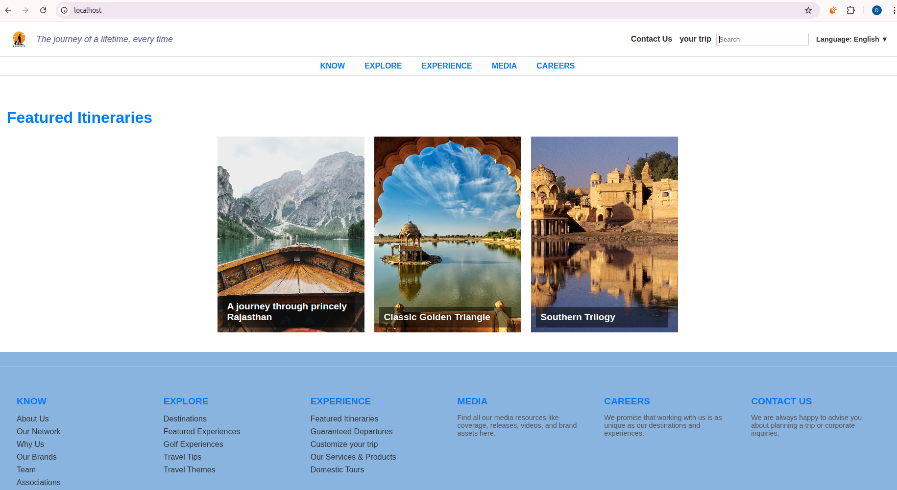

# 🌐 Wixflux-Web-App

A simple and responsive static website built with HTML, CSS, and images — now containerized using Docker for easy deployment!



---

## 📦 Features

- ⚡ Lightweight and fast-loading
- 🧱 Built using `HTML5`, `CSS3`
- 📷 Includes image gallery (4 images)
- 🐳 Dockerized for consistent deployment
- 📁 Clean project structure with all assets

---

## 📁 Project Structure

Wixflux-Web-App/
├── Dockerfile # Docker setup
├── index.html # Main HTML file
├── style.css # Styling
├── logo.png # Website logo
├── img1.jpg - img4.jpg # Image gallery assets
├── ScreenShoot/ # Project screenshots
└── README.md # You're here!


---

## 🚀 Getting Started

You can view the project in your browser or run it using Docker.

### 🔧 Local Setup (Without Docker)

```bash
git clone https://github.com/Dineshvaishnav8890/Wixflux-Web-App.git
cd Wixflux-Web-App
open index.html


🐳 Dockerized Deployment
To run the site in a Docker container:

bash
Copy
Edit
# Clone repository
git clone https://github.com/Dineshvaishnav8890/Wixflux-Web-App.git
cd Wixflux-Web-App

# Build Docker image
docker build -t wixflux-app .

# Run container
docker run -d -p 80:80 wixflux-app


🔗 Visit: http://localhost:80


